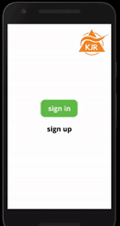

## InterCos 31

InterCos 31 is an international team of four bachelor students in various fields of study, working toward the development of a single digital solution to design constraints and problems presented by the Munich City Youth District Association. The team was created in a challenge hosted by Hochschule München (HM) in the fall of 2020 in the midst of the COVID-19 pandemic.

 

---

**The Problem**

The Kreisjugendring München-Stadt (KJR) lacks appropriate digital means of communication and engagement with youth in processes within the city of Munich. Youngsters in the KJR's normally engaged in processes in-person at local youth centers under the supervision of group leaders. The onset of COVID-19 limited such activities, and thus stifled youth engagement dramatically.

*Read the* [Problem Statement](https://github.com/gxc-international-innovation-challenge/gxc-team-31/wiki/Problem-Statement) *here.*
 

---

  

**The Solution** 

A digital tool that aims to support the KJR in offering processes that include discussion, voting, and information exchange for interestesd youngster. (Age group: 6y.-21y.)
Also offering relevant administrativ options and a "For Kids" mode that enables younger/disadvantaged to take part in processes of their local communities.

---

**APPROACH**

The problem was approached systematically through a process beginning with research, followed by rapid brainstorming, ideation, and prototyping.

- Research: A wide breadth of interviews were conducted with youngsters as well as educators to gain a deeper understanding and perspective. Supported by a study of precedent projects that have dealt with similar situations in different regions around the world. *Checkout the* [Interviews](https://github.com/gxc-international-innovation-challenge/gxc-team-31/wiki/Stakeholder-Interviews) *and* [Research](https://github.com/gxc-international-innovation-challenge/gxc-team-31/wiki/Research)
 

- Brainstorming & Ideation: The next phase involved a synthesis of the research data acquired into a series of imaginary documents, including a storyboard, a press release, and frequently-asked-questions. This helped to make clearer what sort of solution the team wanted to achieve, and the goals to aim for along the way. *Checkout the* [Storyboard, Press-Release and FAQ](https://github.com/gxc-international-innovation-challenge/gxc-team-31/wiki/Assignment-Ideation)
 
 
 

  

- Prototyping: An [initial prototype](https://www.figma.com/proto/NT97XEBawDZI0jdY4pDuLH/gxc_prototype_v1.0_31?node-id=0%3A1&scaling=scale-down) was produced and shared with the KJR for feedback. The prototype was also tested with other critics including children and web developers. Using feedback from the first prototype we produced an improved [second prototype](https://www.figma.com/proto/2mMAvq56hEX7r5Xwsx5KP8/gxc_prototype_v2.0_31?node-id=0%3A1&scaling=scale-down) featuring a kids version with simplified menu layouts and general improvements in all areas. 
*Instructions for Protoype* [here](https://github.com/gxc-international-innovation-challenge/gxc-team-31/wiki/Prototype)

    

---

**WIKI NAVIGATION**

01 [Home](https://github.com/gxc-international-innovation-challenge/gxc-team-31/wiki)

02 Background 
> A [Team Canvas](https://github.com/gxc-international-innovation-challenge/gxc-team-31/wiki/Team-Canvas)
  B [Problem Statement](https://github.com/gxc-international-innovation-challenge/gxc-team-31/wiki/Problem-Statement)
  C [Research](https://github.com/gxc-international-innovation-challenge/gxc-team-31/wiki/Research)
  D [Interviews](https://github.com/gxc-international-innovation-challenge/gxc-team-31/wiki/Stakeholder-Interviews)

03 [Ideation](https://github.com/gxc-international-innovation-challenge/gxc-team-31/wiki/Assignment-Ideation)

04 [Prototyping](https://github.com/gxc-international-innovation-challenge/gxc-team-31/wiki/Prototype)
> A [Version 1](https://github.com/gxc-international-innovation-challenge/gxc-team-31/wiki/Prototyping-a-solution:--Sprint-1)
  B [Version 2](https://github.com/gxc-international-innovation-challenge/gxc-team-31/wiki/Prototyping-a-solution:--Sprint-2)

05 [Business Model Canvas](https://github.com/gxc-international-innovation-challenge/gxc-team-31/wiki/Business-Model-Canvas)

05 [Final Presentation](https://github.com/gxc-international-innovation-challenge/gxc-team-31/wiki/Final-Presentation)

